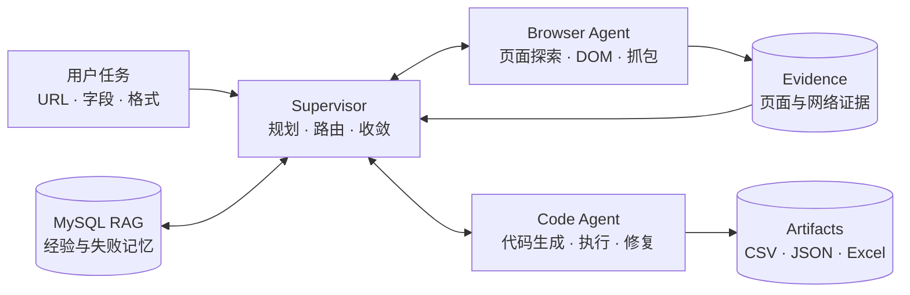

<div align="center">

# 🕷️ Crawler Agent

### 用一句自然语言，把网页变成结构化数据

基于 **LangGraph、Playwright MCP 与 DeepSeek** 的多 Agent 智能爬虫。<br>
自动探索页面、识别数据接口、生成采集代码，并交付 CSV / JSON / Excel 数据。

[](https://www.python.org/)
[](https://nodejs.org/)
[](https://www.mysql.com/)
[](LICENSE)

[快速开始](#-快速开始) · [工作原理](#-工作原理) · [配置](#%EF%B8%8F-配置) · [项目结构](#-项目结构) · [文档](#-文档)

</div>

---

## 为什么是 Crawler Agent？

传统爬虫要求开发者预先分析 DOM、接口和分页规则。Crawler Agent 把这些工作交给一组相互协作的 Agent：你只需描述目标网站、所需字段和输出格式，系统会自主完成探索、实现与验证。

```text
爬取 https://example.com 的全部商品，包含名称、价格和链接，保存为 CSV
```

| 能力 | 说明 |
| :--- | :--- |
| **自然语言驱动** | 直接描述采集目标，无需提前编写选择器或 API 路径 |
| **多 Agent 协作** | Supervisor 负责决策，Browser Agent 探索页面，Code Agent 生成并修复采集代码 |
| **现代网页支持** | 基于 Playwright MCP，能够分析 SPA、网络请求与动态交互 |
| **认证状态管理** | 检测登录墙，支持人工登录确认、会话隔离和登录态验证 |
| **经验记忆** | 使用 MySQL RAG 复用站点、策略、接口及失败经验 |
| **可靠交付** | 支持断点恢复、错误分类、进度追踪与结果文件校验 |

## 🧭 工作原理



1. **理解任务**：解析目标 URL、字段、范围和输出格式。
2. **探索站点**：检查页面结构、交互流程与网络接口，必要时处理登录。
3. **选择策略**：结合当前证据和 RAG 历史经验决定采集方式。
4. **生成执行**：编写爬虫代码，处理分页、去重和异常，并自动修复失败。
5. **验证交付**：依据数据量、字段和运行证据判断是否完成，输出数据与日志。

## 🚀 快速开始

### 环境要求

- Python 3.10+
- Node.js 22.19+
- MySQL 8.4+（可选；RAG 默认 fail-open，数据库不可用不会阻塞采集）

### 1. 安装

```bash
git clone https://github.com/Palpitake/crawler.git
cd crawler

python -m venv venv
# Windows
venv\Scripts\activate
# macOS / Linux
# source venv/bin/activate

pip install -r requirements.txt
cd pi-browser-agent
npm install
cd ..
```

### 2. 配置

复制示例配置并补充模型密钥：

```bash
cp .env.mysql.example .env
```

```env
DEEPSEEK_API_KEY=your_api_key

# 可选：启用 MySQL RAG
RAG_BACKEND=mysql
RAG_MYSQL_HOST=127.0.0.1
RAG_MYSQL_PORT=3306
RAG_MYSQL_DATABASE=crawler_rag
RAG_MYSQL_USER=crawler_rag_app
RAG_MYSQL_PASSWORD=change_me
```

> PowerShell 用户可使用 `Copy-Item .env.mysql.example .env`。

### 3. 启动 MySQL RAG（可选）

```bash
docker compose -f docker-compose.mysql.yml --env-file .env up -d
python scripts/rag_health.py
```

也可以连接已有 MySQL，并手动导入表结构：

```bash
mysql -u root -p < crawler_agent/rag/sql/001_mysql_rag_schema.sql
```

### 4. 运行

交互模式：

```bash
python main.py
```

直接提交任务：

```bash
python main.py "获取 https://news.ycombinator.com 前 10 条新闻的标题和链接，保存为 JSON"
```

任务产物保存在 `crawler_workspace/`，包括生成的代码、结构化数据和执行日志。

## 🧠 经验记忆

RAG 将探索结果沉淀为结构化经验，让后续任务少走弯路。

| 记忆类型 | 内容 |
| :--- | :--- |
| `site` | 路由、页面类型与认证风险 |
| `strategy` | 数据源、交互方式、字段映射与分页策略 |
| `endpoint` | API 来源、请求与响应特征 |
| `authentication` | 已观察到的认证状态与验证行为 |
| `failure` | 根因、终止症状、重试策略与阻断 TTL |

当 MySQL 暂时不可用时，系统默认降级到 JSONL 并继续执行。仅在专门测试 RAG 时才建议设置 `RAG_FAIL_OPEN=false`。

## ⚙️ 配置

常用选项如下；完整配置见 [.env.mysql.example](.env.mysql.example)。

| 变量 | 默认值 | 用途 |
| :--- | :--- | :--- |
| `RAG_BACKEND` | `mysql` | 选择 `mysql`、`jsonl` 或 `disabled` |
| `RAG_FAIL_OPEN` | `true` | RAG 故障时继续执行采集任务 |
| `RAG_DUAL_WRITE_JSONL` | `false` | 同时写入 JSONL 备份 |
| `RAG_MYSQL_POOL_SIZE` | `6` | MySQL 连接池大小 |
| `RAG_TOP_K_STRATEGY` | `8` | 策略记忆召回数量 |
| `BROWSER_ACCOUNT_ALIAS` | `default` | 隔离不同账号的浏览器会话 |
| `BROWSER_AUTH_ALLOWED_DOMAINS` | — | 显式允许的 SSO / IdP 域名 |

## 🗂️ 项目结构

```text
crawler/
├── main.py                         # CLI 入口
├── crawler_agent/                  # Python 核心包
│   ├── auth/                       # 认证决策、证据与会话生命周期
│   ├── core/                       # 日志、公共模型与运行时事实
│   ├── pipelines/                  # Supervisor / Browser / Code 流程
│   ├── rag/                        # MySQL RAG、排序与记忆写入
│   ├── runtimes/                   # Agent 运行时适配
│   └── tools/                      # 浏览器与代码执行工具
├── pi-browser-agent/               # Node.js Agent 运行时
├── scripts/                        # RAG 初始化、健康检查与维护脚本
├── tests/                          # 离线测试
├── docs/                           # 专题文档
└── docker-compose.mysql.yml        # 本地 MySQL 服务
```

## 🛠️ 运维与验证

```bash
# RAG 健康检查
python scripts/rag_health.py

# 过期清理、失败隔离与可靠度重算
python scripts/rag_maintenance.py

# 迁移旧 JSONL（先预演）
python scripts/rag_migrate.py path/to/crawler_rag.jsonl --dry-run
python scripts/rag_migrate.py path/to/crawler_rag.jsonl

# Python 测试
python -m pytest

# Node.js 语法检查
cd pi-browser-agent && npm run check
```

## 🔐 安全与隐私

- Cookie、令牌、密码和 storage state 路径不会写入 MySQL。
- 敏感 URL 参数在持久化前会被移除或脱敏。
- 响应正文与浏览器 storage state 不会保存到 RAG 数据库。
- 人工确认登录不会被直接视为成功；系统会返回目标站点再次验证。
- 会话按站点、账号和浏览器环境隔离，并支持过期与隔离策略。

请确保你的采集行为符合目标网站的服务条款、`robots.txt` 及适用法律法规。

## 📚 文档

- [MySQL RAG：表结构、检索与维护](docs/RAG_MYSQL.md)
- [认证架构：验证契约、状态归约与会话管理](docs/AUTHENTICATION.md)

## 🤝 参与贡献

欢迎提交 Issue 或 Pull Request。新增认证状态转换或会话生命周期行为时，请同步补充 `tests/test_auth_domain.py` 或 `tests/test_auth_sessions.py` 中的离线测试。

## 📄 License

本项目基于 [MIT License](LICENSE) 开源。
